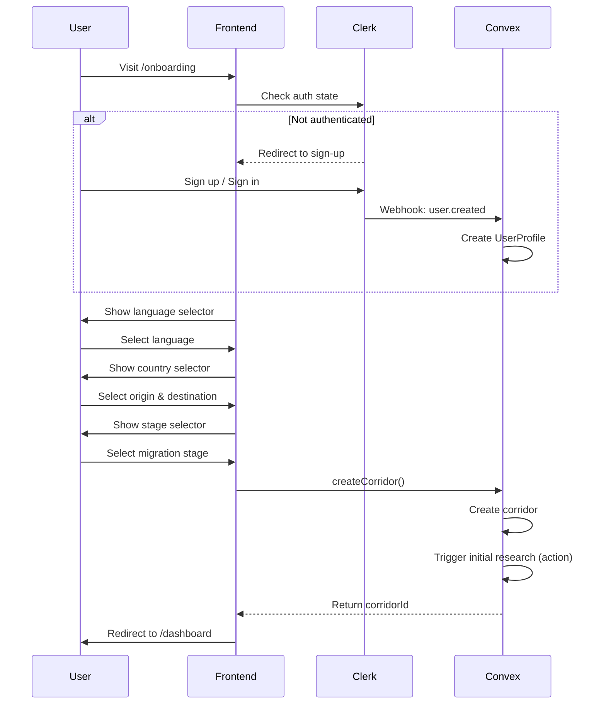
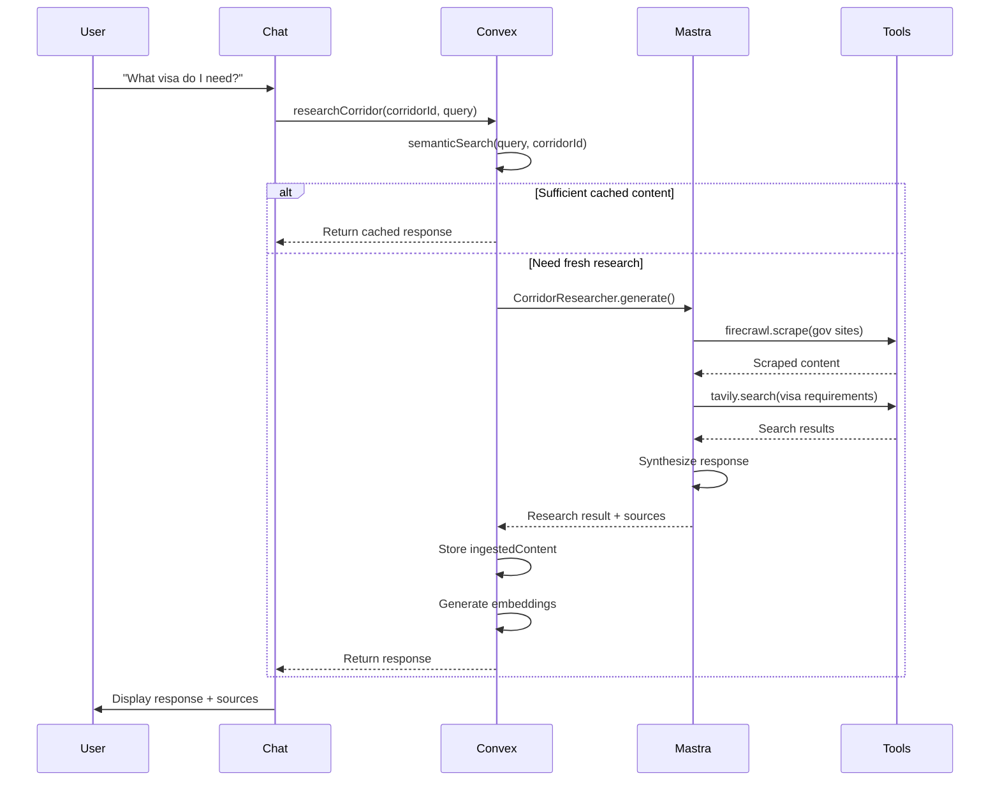
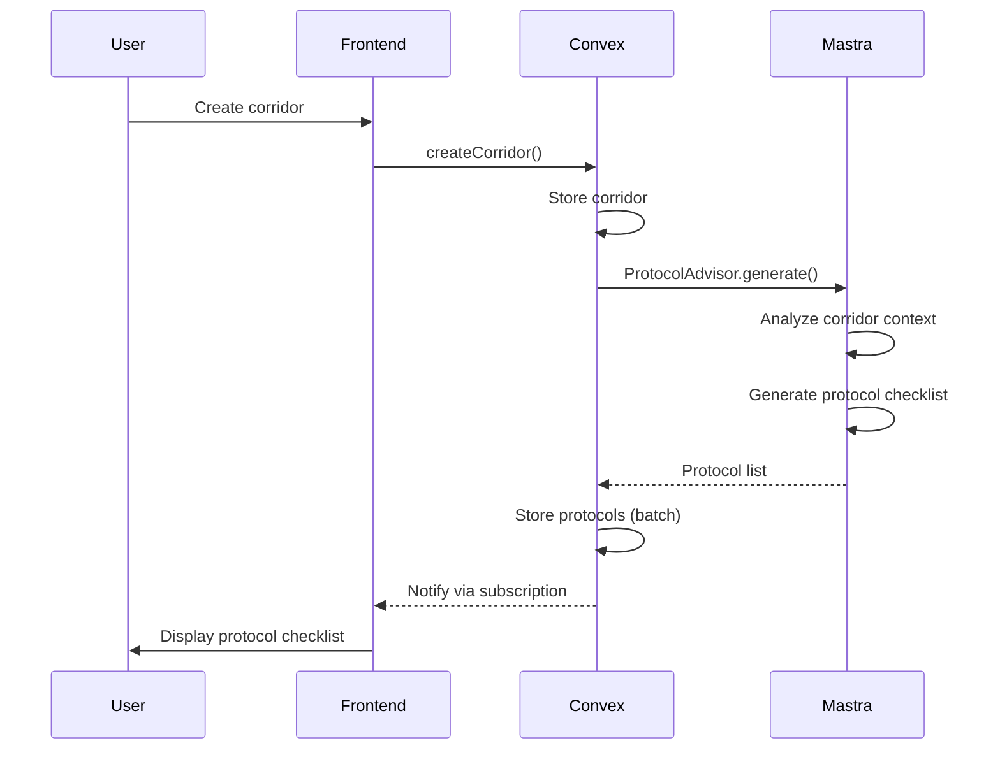
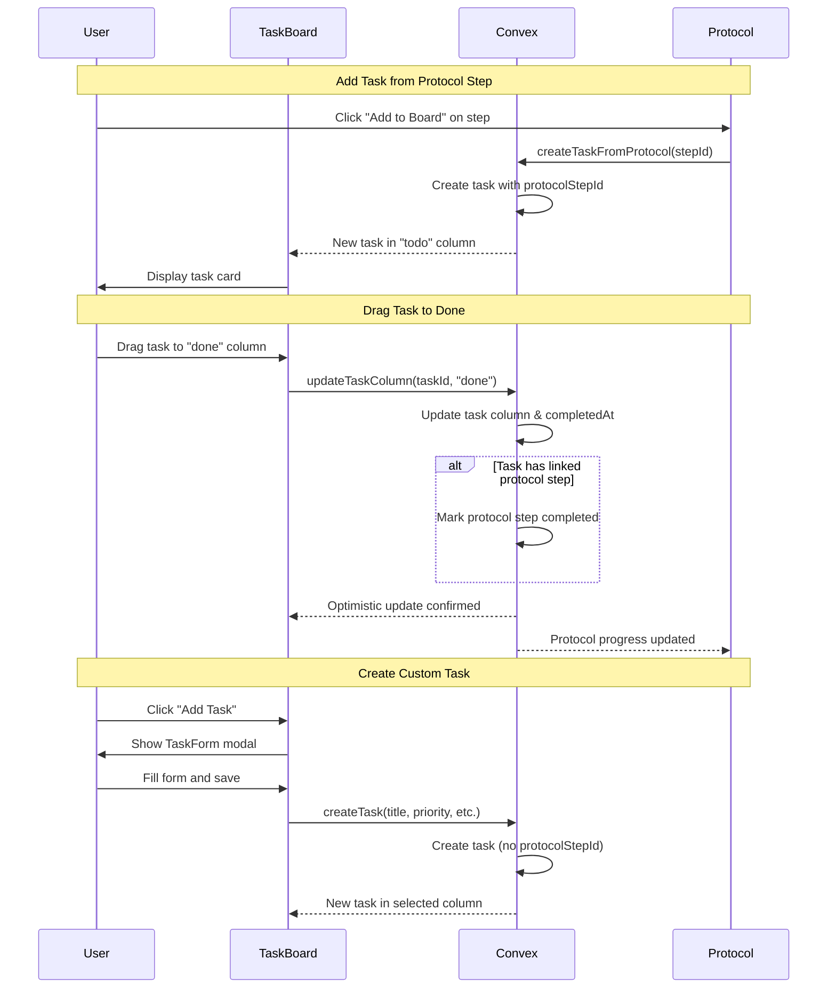
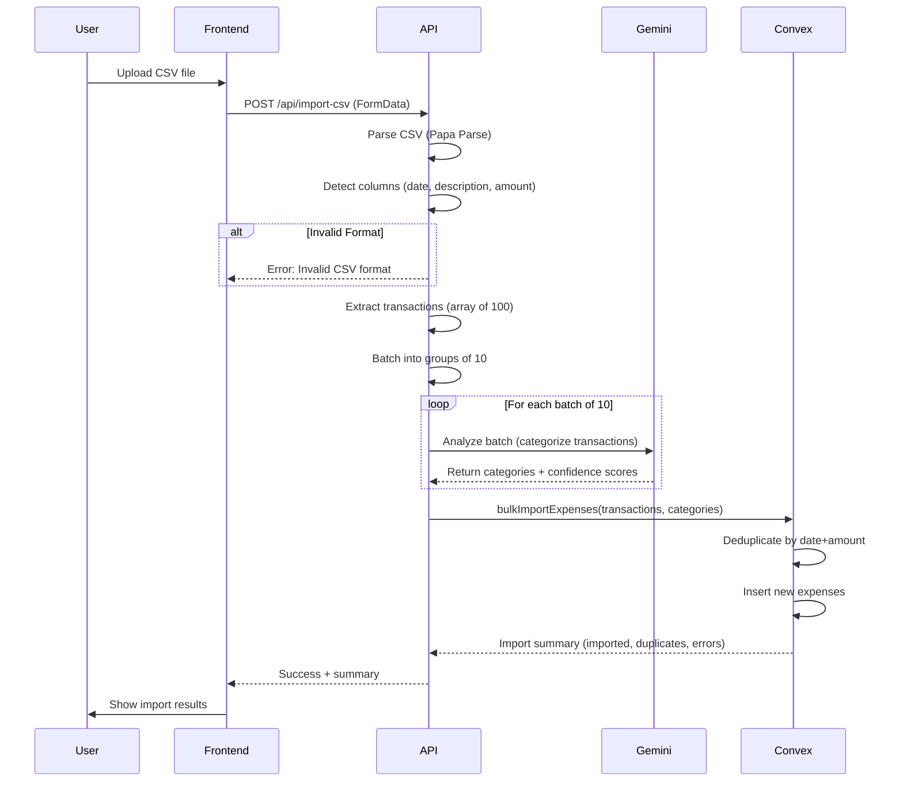
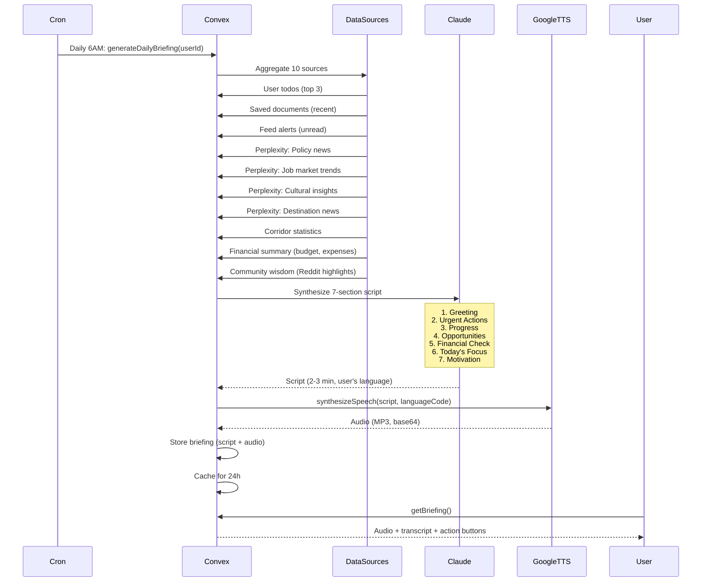
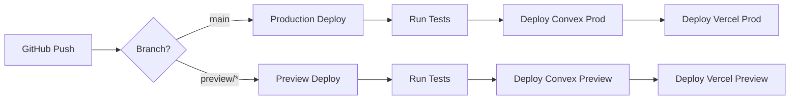

# TRIBE - The Diaspora Intelligence Network
## Fullstack Architecture Document

**Version:** 1.0
**Date:** December 21, 2025
**Author:** Winston (Architect Agent)

---

## Table of Contents

1. [Introduction](#1-introduction)
2. [High Level Architecture](#2-high-level-architecture)
3. [Tech Stack](#3-tech-stack)
4. [Data Models](#4-data-models)
5. [API Specification](#5-api-specification)
6. [Components](#6-components)
7. [External APIs](#7-external-apis)
8. [Core Workflows](#8-core-workflows)
9. [Database Schema](#9-database-schema)
10. [Frontend Architecture](#10-frontend-architecture)
11. [Backend Architecture](#11-backend-architecture)
12. [Unified Project Structure](#12-unified-project-structure)
13. [Development Workflow](#13-development-workflow)
14. [Deployment Architecture](#14-deployment-architecture)
15. [Security and Performance](#15-security-and-performance)
16. [Testing Strategy](#16-testing-strategy)
17. [Coding Standards](#17-coding-standards)
18. [Error Handling Strategy](#18-error-handling-strategy)
19. [Monitoring and Observability](#19-monitoring-and-observability)

---

## 1. Introduction

This document outlines the complete fullstack architecture for TRIBE - The Diaspora Intelligence Network, an AI-powered migration intelligence platform that aggregates diaspora community knowledge to help migrants navigate relocation pathways. It serves as the single source of truth for AI-driven development, ensuring consistency across the entire technology stack.

### Starter Template

**N/A - Greenfield project**

TRIBE is built from scratch using a modern Convex + Next.js stack optimized for real-time AI interactions and multi-language support.

### Change Log

| Date | Version | Description | Author |
|------|---------|-------------|--------|
| 2025-12-21 | 1.0 | Initial architecture document | Winston |
| 2025-12-22 | 1.1 | Added Google Cloud Translation integration for dynamic content | Claude |
| 2025-12-22 | 1.2 | Added Cultural Bridge feature architecture (Epic 6) | Claude |
| 2025-12-22 | 1.3 | Added Mastra + CopilotKit A2UI integration pattern | Claude |
| 2025-12-22 | 1.4 | Changed AI model from Claude to Gemini 2.0 Flash | Claude |
| 2025-12-26 | 1.5 | Added Task Board (Kanban) architecture (Epic 7) | Claude |
| 2025-12-29 | 1.6 | Added Epic 9: Financial Tracker (CSV import, AI categorization, savings goals, exchange rates), Travel Buddy API expansion (visa pathway discovery), Enhanced Audio Briefings (10 data sources, Google Cloud TTS) | Winston |

---

## 2. High Level Architecture

### Technical Summary

TRIBE employs a serverless-first architecture built on Convex for real-time database and backend functions, with Next.js 14 App Router for the frontend. The platform uses Mastra for AI agent orchestration, enabling dynamic corridor research that aggregates visa requirements, cost of living data, and community insights. CopilotKit with AG-UI protocol provides the agentic chat interface with bidirectional state synchronization. The system supports 5 languages (English, Yoruba, Hindi, Portuguese, Tagalog) through next-intl, with ElevenLabs powering voice interactions. Deployment targets Vercel for the frontend and Convex Cloud for backend services.

### Platform and Infrastructure

**Platform:** Vercel + Convex Cloud
**Key Services:**
- Convex (real-time database, serverless functions, vector search)
- Vercel (frontend hosting, edge functions, analytics)
- Clerk (authentication)
- Upstash Redis (rate limiting, caching)

**Deployment Regions:**
- Primary: US East (Vercel + Convex)
- Edge: Global (Vercel Edge Network)

### Repository Structure

**Approach:** Monorepo with npm workspaces

```
tribe-ai/
├── apps/
│   └── web/              # Next.js 14 application
├── packages/
│   ├── shared/           # Shared types and utilities
│   └── ui/               # Shared UI components (RetroUI customizations)
├── convex/               # Convex backend (co-located)
├── agents/               # Mastra agent definitions
└── docs/                 # Documentation
```

### System Architecture Diagram

```
┌─────────────────────────────────────────────────────────────────────────┐
│                              TRIBE PLATFORM                              │
├─────────────────────────────────────────────────────────────────────────┤
│                                                                          │
│  ┌──────────────┐    ┌──────────────┐    ┌──────────────┐               │
│  │   Next.js    │    │  CopilotKit  │    │  ElevenLabs  │               │
│  │  Dashboard   │◄──►│   AG-UI      │◄──►│    Voice     │               │
│  │  (RetroUI)   │    │    Chat      │    │    Agent     │               │
│  └──────┬───────┘    └──────┬───────┘    └──────────────┘               │
│         │                   │                                            │
│         ▼                   ▼                                            │
│  ┌─────────────────────────────────────────────────────────┐            │
│  │                    CONVEX BACKEND                        │            │
│  │  ┌─────────────┐  ┌─────────────┐  ┌─────────────┐      │            │
│  │  │  Queries    │  │  Mutations  │  │   Actions   │      │            │
│  │  │  (Reads)    │  │  (Writes)   │  │ (AI/External)│     │            │
│  │  └─────────────┘  └─────────────┘  └──────┬──────┘      │            │
│  │                                           │              │            │
│  │  ┌─────────────────────────────────────────────────┐    │            │
│  │  │              MASTRA AGENTS                       │    │            │
│  │  │  ┌─────────────┐  ┌─────────────┐               │    │            │
│  │  │  │  Corridor   │  │  Protocol   │               │    │            │
│  │  │  │  Researcher │  │   Advisor   │               │    │            │
│  │  │  └──────┬──────┘  └──────┬──────┘               │    │            │
│  │  └─────────┼────────────────┼──────────────────────┘    │            │
│  │            │                │                            │            │
│  │            ▼                ▼                            │            │
│  │  ┌─────────────────────────────────────────────────┐    │            │
│  │  │              EXTERNAL TOOLS                      │    │            │
│  │  │  Firecrawl │ Tavily │ Perplexity │ Reddit API   │    │            │
│  │  └─────────────────────────────────────────────────┘    │            │
│  │                                                          │            │
│  │  ┌─────────────────────────────────────────────────┐    │            │
│  │  │              CONVEX DATABASE                     │    │            │
│  │  │  corridors │ protocols │ ingestedContent        │    │            │
│  │  │  (+ Vector Index for RAG)                       │    │            │
│  │  └─────────────────────────────────────────────────┘    │            │
│  └─────────────────────────────────────────────────────────┘            │
│                                                                          │
└─────────────────────────────────────────────────────────────────────────┘
```

---

## 3. Tech Stack

### Frontend

| Technology | Purpose | Version |
|------------|---------|---------|
| Next.js | React framework with App Router | 14.x |
| TypeScript | Type safety | 5.x |
| Tailwind CSS | Utility-first styling | 3.x |
| RetroUI | Neobrutalist component library | latest |
| CopilotKit | Agentic chat UI | 1.x |
| next-intl | Internationalization (5 languages) | 3.x |
| @dnd-kit/core | Drag-and-drop for Kanban board | 6.x |
| @dnd-kit/sortable | Sortable items within columns | 8.x |
| Framer Motion | Animations | 10.x |
| React Flow | Pathway visualization | 11.x |

### Backend

| Technology | Purpose | Version |
|------------|---------|---------|
| Convex | Real-time database + serverless functions | latest |
| Mastra | AI agent orchestration | 0.x |
| Clerk | Authentication | 5.x |
| Voyage AI | Embeddings (voyage-3, 1024 dims) | API |

### External Services

| Service | Purpose |
|---------|---------|
| Google Gemini | LLM for agent reasoning (gemini-3-flash-preview) |
| Google Cloud Translation | Dynamic content translation (130+ languages) |
| ElevenLabs | Text-to-speech, speech-to-text |
| Firecrawl | Web scraping |
| Tavily | Web search |
| Perplexity | Real-time policy queries |
| Upstash Redis | Rate limiting, caching |

### Infrastructure

| Service | Purpose |
|---------|---------|
| Vercel | Frontend hosting, edge functions |
| Convex Cloud | Backend hosting |
| Sentry | Error monitoring |
| PostHog | Product analytics |

---

## 4. Data Models

### Core Entities

```typescript
// Corridor: A migration pathway between two countries
interface Corridor {
  _id: Id<"corridors">;
  userId: Id<"users">;
  origin: string;        // ISO country code
  destination: string;   // ISO country code
  stage: "dreaming" | "planning" | "preparing" | "relocating" | "settling";
  createdAt: number;
  updatedAt: number;
}

// Protocol: A checklist item for migration preparation
interface Protocol {
  _id: Id<"protocols">;
  corridorId: Id<"corridors">;
  category: "visa" | "finance" | "housing" | "employment" | "legal" | "health" | "social";
  title: string;
  description: string;
  status: "not_started" | "in_progress" | "completed" | "blocked";
  priority: "critical" | "high" | "medium" | "low";
  dueDate?: number;
  completedAt?: number;
  aiGenerated: boolean;
}

// IngestedContent: RAG content from web scraping
interface IngestedContent {
  _id: Id<"ingestedContent">;
  corridorId: Id<"corridors">;
  url: string;
  title: string;
  content: string;
  embedding: number[];   // 1024 dimensions (Voyage AI)
  source: "reddit" | "forum" | "blog" | "government" | "news";
  scrapedAt: number;
  expiresAt: number;
}

// UserProfile: Extended user data
interface UserProfile {
  _id: Id<"users">;
  clerkId: string;
  email: string;
  name: string;
  language: "en" | "yo" | "hi" | "pt" | "tl";
  onboardingComplete: boolean;
  createdAt: number;
}

// ChatMessage: Conversation history
interface ChatMessage {
  _id: Id<"chatMessages">;
  corridorId: Id<"corridors">;
  role: "user" | "assistant";
  content: string;
  metadata?: {
    toolCalls?: string[];
    sources?: string[];
  };
  createdAt: number;
}

// CulturalProfile: User's cultural background and values
interface CulturalProfile {
  _id: Id<"culturalProfiles">;
  userId: Id<"users">;
  originCulture: string;           // e.g., "Nigerian Yoruba", "Indian Tamil"
  communicationStyle: "direct" | "indirect" | "context-dependent";
  familyStructure: "nuclear" | "extended" | "multi-generational";
  timeOrientation: "monochronic" | "polychronic";
  values: string[];                // e.g., ["respect for elders", "hospitality"]
  foodDietary: string[];           // e.g., ["halal", "vegetarian", "no restrictions"]
  celebrations: string[];          // Major holidays/celebrations
  interviewResponses: Record<string, string>;  // Full interview Q&A
  createdAt: number;
  updatedAt: number;
}

// CulturalCard: Shareable cultural education card
interface CulturalCard {
  _id: Id<"culturalCards">;
  userId: Id<"users">;
  variant: "neighbors" | "coworkers" | "schools" | "general";
  title: string;
  content: {
    greeting: string;
    communication: string;
    food: string;
    holidays: string;
    whatToKnow: string;
  };
  language: string;                // Language of this card
  shareUrl?: string;
  generatedAt: number;
}

// BelongingMilestone: Integration journey tracking
interface BelongingMilestone {
  _id: Id<"belongingMilestones">;
  userId: Id<"users">;
  category: "social" | "cultural" | "knowledge" | "community";
  title: string;
  description: string;
  completedAt?: number;
  notes?: string;
  points: number;                  // Contribution to belonging score
}

// LocalCustom: Destination culture knowledge base
interface LocalCustom {
  _id: Id<"localCustoms">;
  country: string;
  category: "workplace" | "social" | "dining" | "relationships" | "public" | "holidays";
  title: string;
  description: string;
  whyExplanation: string;          // Cultural context/history
  doTips: string[];
  dontTips: string[];
  recoveryPhrases: string[];       // How to recover if you mess up
  sources: string[];
}

// Task: User-created or protocol-derived action items (Kanban board)
interface Task {
  _id: Id<"tasks">;
  corridorId: Id<"corridors">;     // Journey-scoped
  protocolStepId?: Id<"protocols">; // Optional link to protocol step
  title: string;
  description?: string;
  column: "todo" | "in_progress" | "blocked" | "done";
  priority: "critical" | "high" | "medium" | "low";
  category?: "visa" | "finance" | "housing" | "employment" | "legal" | "health" | "social";
  dueDate?: number;
  order: number;                   // Position within column for drag-drop
  notes?: string;                  // User notes/comments
  completedAt?: number;
  createdAt: number;
  updatedAt: number;
}
```

### Relationships

```
User (1) ──────< Corridor (many)
Corridor (1) ──────< Protocol (many)
Corridor (1) ──────< IngestedContent (many)
Corridor (1) ──────< ChatMessage (many)
Corridor (1) ──────< Task (many)
Protocol (1) ──────< Task (optional, 0..1) # Task may reference a protocol step
```

---

## 5. API Specification

### Convex Functions

TRIBE uses Convex's function types instead of traditional REST endpoints:

#### Queries (Read Operations)

```typescript
// convex/corridors.ts
export const getCorridor = query({
  args: { id: v.id("corridors") },
  returns: v.union(v.object({...}), v.null()),
  handler: async (ctx, { id }) => { ... }
});

export const getUserCorridors = query({
  args: {},
  returns: v.array(v.object({...})),
  handler: async (ctx) => { ... }
});

// convex/protocols.ts
export const getProtocols = query({
  args: { corridorId: v.id("corridors") },
  returns: v.array(v.object({...})),
  handler: async (ctx, { corridorId }) => { ... }
});

// convex/tasks.ts
export const getTasks = query({
  args: { corridorId: v.id("corridors") },
  returns: v.array(v.object({...})),
  handler: async (ctx, { corridorId }) => { ... }
});

export const getTasksByColumn = query({
  args: { corridorId: v.id("corridors"), column: v.string() },
  returns: v.array(v.object({...})),
  handler: async (ctx, { corridorId, column }) => { ... }
});

export const getTaskForProtocolStep = query({
  args: { protocolStepId: v.id("protocols") },
  returns: v.union(v.object({...}), v.null()),
  handler: async (ctx, { protocolStepId }) => { ... }
});
```

#### Mutations (Write Operations)

```typescript
// convex/corridors.ts
export const createCorridor = mutation({
  args: { origin: v.string(), destination: v.string(), stage: v.string() },
  returns: v.id("corridors"),
  handler: async (ctx, args) => { ... }
});

// convex/protocols.ts
export const updateProtocolStatus = mutation({
  args: { id: v.id("protocols"), status: v.string() },
  returns: v.null(),
  handler: async (ctx, { id, status }) => { ... }
});

// convex/tasks.ts
export const createTask = mutation({
  args: {
    corridorId: v.id("corridors"),
    title: v.string(),
    description: v.optional(v.string()),
    priority: v.string(),
    category: v.optional(v.string()),
    dueDate: v.optional(v.number()),
    column: v.optional(v.string()), // defaults to "todo"
  },
  returns: v.id("tasks"),
  handler: async (ctx, args) => { ... }
});

export const createTaskFromProtocol = mutation({
  args: { protocolStepId: v.id("protocols") },
  returns: v.id("tasks"),
  handler: async (ctx, { protocolStepId }) => {
    // Create task linked to protocol step
    // Inherit title, description, priority from protocol
  }
});

export const updateTaskColumn = mutation({
  args: {
    taskId: v.id("tasks"),
    column: v.string(),
    order: v.number(),
  },
  returns: v.null(),
  handler: async (ctx, { taskId, column, order }) => {
    // Update task column and order
    // If column is "done" and task has protocolStepId, mark protocol step complete
  }
});

export const updateTask = mutation({
  args: {
    taskId: v.id("tasks"),
    title: v.optional(v.string()),
    description: v.optional(v.string()),
    priority: v.optional(v.string()),
    category: v.optional(v.string()),
    dueDate: v.optional(v.number()),
    notes: v.optional(v.string()),
  },
  returns: v.null(),
  handler: async (ctx, args) => { ... }
});

export const deleteTask = mutation({
  args: { taskId: v.id("tasks") },
  returns: v.null(),
  handler: async (ctx, { taskId }) => { ... }
});

export const reorderTasks = mutation({
  args: {
    taskIds: v.array(v.id("tasks")),
    orders: v.array(v.number()),
  },
  returns: v.null(),
  handler: async (ctx, { taskIds, orders }) => {
    // Batch update task orders for drag-drop reordering
  }
});
```

#### Actions (AI/External Operations)

```typescript
// convex/ai/research.ts
export const researchCorridor = action({
  args: { corridorId: v.id("corridors"), query: v.string() },
  returns: v.object({ response: v.string(), sources: v.array(v.string()) }),
  handler: async (ctx, { corridorId, query }) => {
    // Execute Mastra agent
    // Store ingested content
    // Return response
  }
});

// convex/ai/search.ts
export const semanticSearch = action({
  args: { query: v.string(), corridorId: v.id("corridors"), limit: v.optional(v.number()) },
  returns: v.array(v.object({...})),
  handler: async (ctx, { query, corridorId, limit = 10 }) => {
    const queryVector = await voyage.embed({ input: [query], model: "voyage-3" });
    return await ctx.vectorSearch("ingestedContent", "by_embedding", {
      vector: queryVector,
      limit,
      filter: (q) => q.eq("corridorId", corridorId),
    });
  }
});
```

### API Routes (Next.js)

```typescript
// app/api/copilotkit/route.ts - CopilotKit runtime
// app/api/webhooks/clerk/route.ts - Clerk webhook handler
// app/api/webhooks/convex/route.ts - Convex webhook handler
// app/api/health/route.ts - Health check endpoint
```

---

## 6. Components

### Component Architecture

```
components/
├── ui/                    # Base UI components (RetroUI + custom)
│   ├── button.tsx
│   ├── card.tsx
│   ├── input.tsx
│   └── ...
├── layout/                # Layout components
│   ├── Header.tsx
│   ├── Sidebar.tsx
│   ├── Footer.tsx
│   └── MobileNav.tsx
├── corridor/              # Corridor-specific components
│   ├── CorridorCard.tsx
│   ├── CorridorSelector.tsx
│   ├── StageIndicator.tsx
│   └── CorridorMap.tsx
├── protocol/              # Protocol components
│   ├── ProtocolCard.tsx
│   ├── ProtocolChecklist.tsx
│   ├── ProtocolProgress.tsx
│   └── ProtocolCategory.tsx
├── chat/                  # Chat interface components
│   ├── ChatWindow.tsx
│   ├── MessageBubble.tsx
│   ├── SourceCard.tsx
│   └── SuggestedQuestions.tsx
├── onboarding/            # Onboarding flow
│   ├── OnboardingWizard.tsx
│   ├── CountrySelector.tsx
│   ├── StageSelector.tsx
│   └── LanguageSelector.tsx
├── voice/                 # Voice interaction
│   ├── VoiceAgent.tsx
│   ├── AudioBriefing.tsx
│   └── VoiceControls.tsx
├── cultural/              # Cultural Bridge components
│   ├── CulturalProfileBuilder.tsx   # AI-guided interview
│   ├── CulturalProfileSummary.tsx   # Profile display
│   ├── CulturalCard.tsx             # Shareable card component
│   ├── CulturalCardGenerator.tsx    # Card generation UI
│   ├── LocalCustomsDecoder.tsx      # Customs search/display
│   ├── CustomCard.tsx               # Single custom display
│   ├── MicroMomentChat.tsx          # Situation decoder
│   ├── BelongingDashboard.tsx       # Integration tracking
│   ├── MilestoneCard.tsx            # Single milestone
│   └── BelongingScore.tsx           # Score visualization
├── taskboard/             # Kanban Task Board components
│   ├── TaskBoard.tsx                # Main board container
│   ├── TaskColumn.tsx               # Kanban column (To Do, In Progress, etc.)
│   ├── TaskCard.tsx                 # Individual task card
│   ├── TaskCardDraggable.tsx        # Draggable wrapper using @dnd-kit
│   ├── TaskDetailModal.tsx          # Task detail/edit modal
│   ├── TaskForm.tsx                 # Create/edit task form
│   ├── TaskFilters.tsx              # Filter bar for category/priority/due date
│   ├── AddTaskButton.tsx            # Floating action button for quick add
│   └── EmptyColumn.tsx              # Empty state for columns
└── providers/             # Context providers
    ├── ConvexProvider.tsx
    ├── CopilotKitProvider.tsx
    ├── ClerkProvider.tsx
    └── IntlProvider.tsx
```

### Key Component Examples

```typescript
// components/corridor/CorridorCard.tsx
"use client";

import { useQuery } from "convex/react";
import { api } from "@/convex/_generated/api";
import { Card, CardHeader, CardContent } from "@/components/ui/card";
import { StageIndicator } from "./StageIndicator";
import { ProtocolProgress } from "../protocol/ProtocolProgress";

interface CorridorCardProps {
  corridorId: Id<"corridors">;
}

export function CorridorCard({ corridorId }: CorridorCardProps) {
  const corridor = useQuery(api.corridors.getCorridor, { id: corridorId });
  const protocols = useQuery(api.protocols.getProtocols, { corridorId });

  if (!corridor) return <CorridorCardSkeleton />;

  return (
    <Card className="border-4 border-black shadow-[4px_4px_0_0_#000]">
      <CardHeader>
        <div className="flex items-center gap-2">
          <CountryFlag code={corridor.origin} />
          <span>→</span>
          <CountryFlag code={corridor.destination} />
        </div>
        <StageIndicator stage={corridor.stage} />
      </CardHeader>
      <CardContent>
        <ProtocolProgress protocols={protocols ?? []} />
      </CardContent>
    </Card>
  );
}
```

---

## 7. External APIs

### API Integration Matrix

| API | Purpose | Rate Limit | Caching |
|-----|---------|------------|---------|
| Travel Buddy API | Visa requirements, pathway discovery | 120/month (free tier), $4.99/month (3k requests) | 7 days in Convex |
| REST Countries | Country metadata | Unlimited | 7 days |
| Voyage AI | Embeddings | 10k/month | N/A (stored) |
| Google Cloud Translation | Dynamic content | 500k chars/month | Convex (content-hash) |
| Google Cloud Text-to-Speech | Audio briefings (220+ languages) | Free tier: 1M chars/month | Audio cached 24h |
| Firecrawl | Web scraping | 500/month | Content stored |
| Tavily | Web search | 1000/month | 1h in Upstash |
| Perplexity | Policy queries | 100/day | 1h in Upstash |
| ElevenLabs | Voice synthesis (legacy) | 10k chars/month | Audio cached |
| exchangeratesapi.io | Real-time exchange rates (primary) | Free tier: 1k requests/month | 24h in Convex |
| exchangerate-api.com | Exchange rates (fallback) | 1.5k requests/month | 24h in Convex |

### API Client Configuration

```typescript
// lib/api/travel-buddy.ts
import { Ratelimit } from "@upstash/ratelimit";
import { Redis } from "@upstash/redis";

const ratelimit = new Ratelimit({
  redis: Redis.fromEnv(),
  limiter: Ratelimit.slidingWindow(120, "30 d"),
  analytics: true,
});

export async function getVisaRequirements(origin: string, destination: string) {
  const { success } = await ratelimit.limit("travel-buddy");
  if (!success) throw new Error("Rate limit exceeded");

  const cached = await redis.get(`visa:${origin}:${destination}`);
  if (cached) return cached;

  const response = await fetch(
    `https://travel-buddy.ai/api/visa?from=${origin}&to=${destination}`,
    { headers: { Authorization: `Bearer ${process.env.TRAVEL_BUDDY_API_KEY}` } }
  );

  const data = await response.json();
  await redis.setex(`visa:${origin}:${destination}`, 86400, JSON.stringify(data));

  return data;
}

// lib/api/translation.ts
import { TranslationServiceClient } from "@google-cloud/translate";
import { createHash } from "crypto";

const translationClient = new TranslationServiceClient();
const projectId = process.env.GOOGLE_CLOUD_PROJECT_ID;
const location = "global";

// Content-hash based caching for translation deduplication
function getContentHash(text: string, targetLang: string): string {
  return createHash("sha256").update(`${text}:${targetLang}`).digest("hex").slice(0, 16);
}

export async function translateDynamicContent(
  text: string,
  targetLang: string,
  sourceLocale: string = "en"
): Promise<{ text: string; cached: boolean }> {
  // Check Convex cache first
  const contentHash = getContentHash(text, targetLang);
  const cached = await ctx.runQuery(api.translations.getCached, { hash: contentHash });
  if (cached) return { text: cached.translatedText, cached: true };

  // Call Google Cloud Translation API
  const [response] = await translationClient.translateText({
    parent: `projects/${projectId}/locations/${location}`,
    contents: [text],
    mimeType: "text/plain",
    sourceLanguageCode: sourceLocale,
    targetLanguageCode: targetLang,
  });

  const translatedText = response.translations?.[0]?.translatedText ?? text;

  // Store in Convex for future requests
  await ctx.runMutation(api.translations.cache, {
    hash: contentHash,
    originalText: text,
    translatedText,
    sourceLocale,
    targetLocale: targetLang,
  });

  return { text: translatedText, cached: false };
}

// lib/api/travel-buddy-extended.ts
// Travel Buddy API v2 - Visa Pathway Discovery
export async function getVisaPathways(originPassport: string) {
  const cached = await ctx.runQuery(api.visas.getCached, { origin: originPassport });
  if (cached && Date.now() - cached.lastUpdated < 7 * 24 * 60 * 60 * 1000) {
    return cached.pathways;
  }

  // Endpoint: /v2/visa/map - Returns all 210 destinations for a passport
  const response = await fetch(
    `https://travel-buddy.ai/api/v2/visa/map?passport=${originPassport}`,
    { headers: { Authorization: `Bearer ${process.env.TRAVEL_BUDDY_API_KEY}` } }
  );

  const data = await response.json();

  // Cache for 7 days
  await ctx.runMutation(api.visas.cache, {
    origin: originPassport,
    pathways: data.destinations,
    lastUpdated: Date.now()
  });

  return data.destinations;
}

export async function getVisaDetails(originPassport: string, destination: string) {
  // Endpoint: /v2/visa/check - Detailed requirements for specific corridor
  const response = await fetch(
    `https://travel-buddy.ai/api/v2/visa/check?passport=${originPassport}&destination=${destination}`,
    { headers: { Authorization: `Bearer ${process.env.TRAVEL_BUDDY_API_KEY}` } }
  );

  return response.json();
}

export async function getPassportRanking(weights: Record<string, number>) {
  // Endpoint: /v2/passport/rank/custom - Difficulty scoring
  const response = await fetch(
    `https://travel-buddy.ai/api/v2/passport/rank/custom`,
    {
      method: "POST",
      headers: {
        Authorization: `Bearer ${process.env.TRAVEL_BUDDY_API_KEY}`,
        "Content-Type": "application/json"
      },
      body: JSON.stringify({ weights })
    }
  );

  return response.json();
}

// lib/api/exchange-rate.ts
export async function getExchangeRate(from: string, to: string) {
  const cached = await ctx.runQuery(api.financial.getExchangeRate, {
    fromCurrency: from,
    toCurrency: to
  });

  if (cached && Date.now() - cached.timestamp < 24 * 60 * 60 * 1000) {
    return cached.rate;
  }

  try {
    // Primary: exchangeratesapi.io
    const apiKey = process.env.EXCHANGE_RATES_API_KEY;
    if (apiKey) {
      const response = await fetch(
        `https://api.exchangeratesapi.io/v1/latest?access_key=${apiKey}&base=${from}&symbols=${to}`
      );
      const data = await response.json();

      if (data.rates?.[to]) {
        await ctx.runMutation(api.financial.cacheExchangeRate, {
          fromCurrency: from,
          toCurrency: to,
          rate: data.rates[to],
          source: "exchangeratesapi.io",
          timestamp: Date.now()
        });
        return data.rates[to];
      }
    }
  } catch (error) {
    console.error("Primary exchange rate API failed, trying fallback");
  }

  // Fallback: exchangerate-api.com (no API key needed)
  const response = await fetch(`https://api.exchangerate-api.com/v4/latest/${from}`);
  const data = await response.json();

  await ctx.runMutation(api.financial.cacheExchangeRate, {
    fromCurrency: from,
    toCurrency: to,
    rate: data.rates[to],
    source: "exchangerate-api.com",
    timestamp: Date.now()
  });

  return data.rates[to];
}

// lib/api/google-tts.ts
import textToSpeech from "@google-cloud/text-to-speech";
const ttsClient = new textToSpeech.TextToSpeechClient();

export async function synthesizeSpeech(
  text: string,
  languageCode: string,
  voiceName?: string
) {
  const [response] = await ttsClient.synthesizeSpeech({
    input: { text },
    voice: {
      languageCode,
      name: voiceName, // Auto-select if not provided
      ssmlGender: "NEUTRAL"
    },
    audioConfig: {
      audioEncoding: "MP3",
      speakingRate: 1.0,
      pitch: 0.0
    }
  });

  return response.audioContent; // Base64 encoded MP3
}
```

---

## 8. Core Workflows

### Onboarding Flow



### Corridor Research Flow



### Protocol Generation Flow



### Task Board Flow



### CSV Import + AI Categorization Flow



**Gemini AI Categorization:**
```typescript
// Batch categorization prompt (10 transactions per call)
const prompt = `Categorize these migration expenses into one of these categories:
- visaImmigration (visa fees, document fees, embassy appointments)
- tests (language tests, medical exams, credential evaluations)
- travel (flights, accommodation, transport)
- settlement (rent, utilities, furniture, moving costs)
- financial (bank fees, money transfers, credit checks)
- miscellaneous (other migration-related expenses)

Transactions:
${transactions.map((t, i) => `${i+1}. ${t.description} - ${t.amount}`).join('\n')}

Return JSON array with: [{ index: 0, category: "visaImmigration", confidence: 95, reason: "..." }]`;

// Cost: 1 Gemini request per 10 transactions
// Free tier: 1,500 requests/day = 15,000 transactions/day
```

### Audio Briefing Generation Flow



**10 Data Sources Aggregation:**
```typescript
// convex/briefings.ts
async function aggregateBriefingData(userId: string, corridorId: string) {
  const [todos, documents, feedAlerts, financialSummary, corridorStats] =
    await Promise.all([
      ctx.db.query("todos").withIndex("by_user", q => q.eq("userId", userId)).take(3),
      ctx.db.query("savedDocuments").withIndex("by_user", q => q.eq("userId", userId)).take(5),
      ctx.db.query("corridorFeed").filter(q => q.eq(q.field("isAlert"), true)).take(3),
      ctx.runQuery(api.financial.getBudgetSummary, { corridorId }),
      ctx.runQuery(api.corridors.getStats, { corridorId })
    ]);

  // Perplexity queries for real-time intelligence
  const perplexityData = await Promise.all([
    perplexity.search(`${corridor.destination} immigration policy changes today`),
    perplexity.search(`${corridor.destination} job market trends tech workers`),
    perplexity.search(`${corridor.destination} cultural events news migrants`),
    perplexity.search(`${corridor.destination} news ${corridor.origin} migrants`)
  ]);

  return {
    todos,
    documents,
    feedAlerts,
    policyNews: perplexityData[0],
    jobTrends: perplexityData[1],
    culturalNews: perplexityData[2],
    destinationNews: perplexityData[3],
    financialSummary,
    corridorStats,
    communityWisdom: await getCommunityHighlights(corridorId) // Reddit top posts
  };
}
```

---

## 9. Database Schema

### Convex Schema Definition

```typescript
// convex/schema.ts
import { defineSchema, defineTable } from "convex/server";
import { v } from "convex/values";

export default defineSchema({
  users: defineTable({
    clerkId: v.string(),
    email: v.string(),
    name: v.string(),
    language: v.union(
      v.literal("en"),
      v.literal("yo"),
      v.literal("hi"),
      v.literal("pt"),
      v.literal("tl")
    ),
    onboardingComplete: v.boolean(),
    createdAt: v.number(),
  })
    .index("by_clerk_id", ["clerkId"])
    .index("by_email", ["email"]),

  corridors: defineTable({
    userId: v.id("users"),
    origin: v.string(),
    destination: v.string(),
    stage: v.union(
      v.literal("dreaming"),
      v.literal("planning"),
      v.literal("preparing"),
      v.literal("relocating"),
      v.literal("settling")
    ),
    createdAt: v.number(),
    updatedAt: v.number(),
  })
    .index("by_user", ["userId"])
    .index("by_corridor", ["origin", "destination"]),

  protocols: defineTable({
    corridorId: v.id("corridors"),
    category: v.union(
      v.literal("visa"),
      v.literal("finance"),
      v.literal("housing"),
      v.literal("employment"),
      v.literal("legal"),
      v.literal("health"),
      v.literal("social")
    ),
    title: v.string(),
    description: v.string(),
    status: v.union(
      v.literal("not_started"),
      v.literal("in_progress"),
      v.literal("completed"),
      v.literal("blocked")
    ),
    priority: v.union(
      v.literal("critical"),
      v.literal("high"),
      v.literal("medium"),
      v.literal("low")
    ),
    dueDate: v.optional(v.number()),
    completedAt: v.optional(v.number()),
    aiGenerated: v.boolean(),
    order: v.number(),
  })
    .index("by_corridor", ["corridorId"])
    .index("by_status", ["corridorId", "status"])
    .index("by_category", ["corridorId", "category"]),

  ingestedContent: defineTable({
    corridorId: v.id("corridors"),
    url: v.string(),
    title: v.string(),
    content: v.string(),
    embedding: v.array(v.float64()),
    source: v.union(
      v.literal("reddit"),
      v.literal("forum"),
      v.literal("blog"),
      v.literal("government"),
      v.literal("news")
    ),
    metadata: v.object({
      author: v.optional(v.string()),
      publishedAt: v.optional(v.number()),
      subreddit: v.optional(v.string()),
    }),
    scrapedAt: v.number(),
    expiresAt: v.number(),
  })
    .index("by_corridor", ["corridorId"])
    .index("by_url", ["url"])
    .index("by_expiry", ["expiresAt"])
    .vectorIndex("by_embedding", {
      vectorField: "embedding",
      dimensions: 1024,
      filterFields: ["corridorId"],
    }),

  chatMessages: defineTable({
    corridorId: v.id("corridors"),
    role: v.union(v.literal("user"), v.literal("assistant")),
    content: v.string(),
    metadata: v.optional(
      v.object({
        toolCalls: v.optional(v.array(v.string())),
        sources: v.optional(v.array(v.string())),
        generationId: v.optional(v.string()),
      })
    ),
    createdAt: v.number(),
  })
    .index("by_corridor", ["corridorId"])
    .index("by_corridor_time", ["corridorId", "createdAt"]),

  audioBriefings: defineTable({
    corridorId: v.id("corridors"),
    type: v.union(
      v.literal("daily"),
      v.literal("weekly"),
      v.literal("protocol_update")
    ),
    audioUrl: v.string(),
    transcript: v.string(),
    duration: v.number(),
    generatedAt: v.number(),
  })
    .index("by_corridor", ["corridorId"])
    .index("by_type", ["corridorId", "type"]),

  // Task Board (Kanban) - User action items
  tasks: defineTable({
    corridorId: v.id("corridors"),
    protocolStepId: v.optional(v.id("protocols")),
    title: v.string(),
    description: v.optional(v.string()),
    column: v.union(
      v.literal("todo"),
      v.literal("in_progress"),
      v.literal("blocked"),
      v.literal("done")
    ),
    priority: v.union(
      v.literal("critical"),
      v.literal("high"),
      v.literal("medium"),
      v.literal("low")
    ),
    category: v.optional(v.union(
      v.literal("visa"),
      v.literal("finance"),
      v.literal("housing"),
      v.literal("employment"),
      v.literal("legal"),
      v.literal("health"),
      v.literal("social")
    )),
    dueDate: v.optional(v.number()),
    order: v.number(),
    notes: v.optional(v.string()),
    completedAt: v.optional(v.number()),
    createdAt: v.number(),
    updatedAt: v.number(),
  })
    .index("by_corridor", ["corridorId"])
    .index("by_corridor_column", ["corridorId", "column"])
    .index("by_protocol_step", ["protocolStepId"])
    .index("by_category", ["corridorId", "category"]),

  // Financial Budgets - Epic 9
  financialBudgets: defineTable({
    userId: v.id("users"),
    corridorId: v.id("corridors"),
    // Currencies
    originCurrency: v.string(), // "NGN", "INR", "PHP", etc.
    destinationCurrency: v.string(), // "CAD", "USD", "GBP", "EUR", etc.
    // Total budget
    totalBudgetOrigin: v.number(), // e.g., ₦2,460,000
    totalBudgetDestination: v.number(), // e.g., CAD $8,500
    createdExchangeRate: v.number(), // Rate when budget was created
    // Category allocations (in destination currency)
    allocations: v.object({
      visaImmigration: v.number(),
      tests: v.number(),
      travel: v.number(),
      settlement: v.number(),
      financial: v.number(),
      miscellaneous: v.number(),
    }),
    createdAt: v.number(),
    updatedAt: v.number(),
  })
    .index("by_user", ["userId"])
    .index("by_corridor", ["corridorId"])
    .index("by_user_corridor", ["userId", "corridorId"]),

  // Individual expenses - Epic 9
  financialExpenses: defineTable({
    userId: v.id("users"),
    corridorId: v.id("corridors"),
    budgetId: v.id("financialBudgets"),
    // Expense details
    name: v.string(),
    category: v.union(
      v.literal("visaImmigration"),
      v.literal("tests"),
      v.literal("travel"),
      v.literal("settlement"),
      v.literal("financial"),
      v.literal("miscellaneous")
    ),
    // Amount
    amountPaid: v.number(),
    currency: v.string(),
    exchangeRate: v.number(), // Rate at time of payment
    amountInDestination: v.number(), // Converted amount
    // Status
    status: v.union(
      v.literal("paid"),
      v.literal("pending"),
      v.literal("planned")
    ),
    datePaid: v.optional(v.number()),
    dateDue: v.optional(v.number()),
    // Metadata
    notes: v.optional(v.string()),
    receiptUrl: v.optional(v.string()),
    createdAt: v.number(),
    updatedAt: v.number(),
  })
    .index("by_budget", ["budgetId"])
    .index("by_user_corridor", ["userId", "corridorId"])
    .index("by_status", ["status"])
    .index("by_date_due", ["dateDue"]),

  // Currency exchange rates (cached) - Epic 9
  currencyRates: defineTable({
    fromCurrency: v.string(), // e.g., "NGN"
    toCurrency: v.string(), // e.g., "CAD"
    rate: v.number(), // e.g., 287.65 (1 CAD = 287.65 NGN)
    source: v.string(), // "exchangerate-api.com" or "exchangeratesapi.io"
    timestamp: v.number(),
  })
    .index("by_pair", ["fromCurrency", "toCurrency"])
    .index("by_timestamp", ["timestamp"]),

  // Savings goals for migration journey - Epic 9
  savingsGoals: defineTable({
    userId: v.id("users"),
    corridorId: v.id("corridors"),
    budgetId: v.id("financialBudgets"),
    // Goal details
    name: v.string(), // e.g., "Emergency Fund", "First Month Rent"
    description: v.optional(v.string()),
    targetAmount: v.number(), // In destination currency
    currentAmount: v.number(), // Amount saved so far
    currency: v.string(), // Destination currency
    // Deadline
    targetDate: v.optional(v.number()),
    // Progress tracking
    milestones: v.optional(
      v.array(
        v.object({
          amount: v.number(),
          label: v.string(),
          achieved: v.boolean(),
          achievedAt: v.optional(v.number()),
        })
      )
    ),
    // Status
    status: v.union(
      v.literal("active"),
      v.literal("completed"),
      v.literal("paused")
    ),
    completedAt: v.optional(v.number()),
    createdAt: v.number(),
    updatedAt: v.number(),
  })
    .index("by_user", ["userId"])
    .index("by_budget", ["budgetId"])
    .index("by_user_corridor", ["userId", "corridorId"])
    .index("by_status", ["status"]),

  // Visa data cache (from Travel Buddy API) - Story 9.13
  visaRequirements: defineTable({
    origin: v.string(),
    destination: v.string(),
    visaRequired: v.boolean(),
    visaType: v.optional(v.string()),
    stayDuration: v.optional(v.number()),
    requirements: v.array(v.string()),
    processingTime: v.optional(v.string()),
    cachedAt: v.number(),
    expiresAt: v.number(),
  })
    .index("by_corridor", ["origin", "destination"])
    .index("by_expiry", ["expiresAt"]),

  // Translation cache (content-hash based deduplication)
  translations: defineTable({
    hash: v.string(),              // SHA256 hash of content + target locale
    originalText: v.string(),
    translatedText: v.string(),
    sourceLocale: v.string(),
    targetLocale: v.string(),
    charCount: v.number(),         // For usage tracking
    createdAt: v.number(),
    expiresAt: v.number(),         // TTL for cache invalidation
  })
    .index("by_hash", ["hash"])
    .index("by_expiry", ["expiresAt"])
    .index("by_locale_pair", ["sourceLocale", "targetLocale"]),
});
```

---

## 10. Frontend Architecture

### State Management

TRIBE uses Convex's built-in reactivity for server state and React Context for UI state:

```typescript
// No separate state management library needed
// Convex provides real-time subscriptions out of the box

// Example: Corridor state is reactive
const corridor = useQuery(api.corridors.getCorridor, { id: corridorId });
// Automatically updates when data changes

// UI state uses React Context
// contexts/UIContext.tsx
interface UIState {
  sidebarOpen: boolean;
  chatMinimized: boolean;
  activeTab: "protocols" | "chat" | "insights";
}
```

### CopilotKit + Mastra A2UI Integration

TRIBE uses the **Mastra + CopilotKit** integration pattern for agentic UIs. This enables bidirectional state synchronization where Mastra agents can render UI components dynamically.

**Key packages:**
- `@copilotkit/react-core` - React hooks for agent interaction
- `@copilotkit/react-ui` - Pre-built chat components
- `@copilotkit/runtime` - Server-side runtime
- `@ag-ui/mastra` - AG-UI protocol adapter for Mastra

**A2UI Widget Pattern:**
Agents return structured widget specifications, which CopilotKit renders as React components:

```typescript
// Agent returns widget spec
{
  widget: "ProtocolCard",
  props: { protocol: {...}, emphasis: "high" }
}

// CopilotKit renders via useCopilotAction
useCopilotAction({
  name: "showProtocolCard",
  render: ({ args }) => <ProtocolCard {...args} />
});
```

See `docs/a2ui-widgets.md` for full widget specifications.

### CopilotKit Provider

```typescript
// components/providers/CopilotKitProvider.tsx
"use client";

import { CopilotKit } from "@copilotkit/react-core";
import { useUser } from "@clerk/nextjs";
import { useQuery } from "convex/react";
import { api } from "@/convex/_generated/api";

export function CopilotKitProvider({ children }: { children: React.ReactNode }) {
  const { user } = useUser();
  const profile = useQuery(api.users.getProfile);
  const activeCorridor = useQuery(api.corridors.getActiveCorridor);

  return (
    <CopilotKit
      runtimeUrl="/api/copilotkit"
      properties={{
        userId: profile?._id,
        corridor: activeCorridor
          ? {
              id: activeCorridor._id,
              origin: activeCorridor.origin,
              destination: activeCorridor.destination,
            }
          : null,
        stage: activeCorridor?.stage,
        language: profile?.language ?? "en",
      }}
    >
      {children}
    </CopilotKit>
  );
}

// components/chat/ChatWindow.tsx
import { useCopilotChat } from "@copilotkit/react-core";
import { useCopilotReadable } from "@copilotkit/react-core";

export function ChatWindow({ corridorId }: { corridorId: Id<"corridors"> }) {
  const corridor = useQuery(api.corridors.getCorridor, { id: corridorId });
  const protocols = useQuery(api.protocols.getProtocols, { corridorId });

  // Sync state to CopilotKit for context-aware responses
  useCopilotReadable({
    description: "Current migration corridor",
    value: corridor,
  });

  useCopilotReadable({
    description: "User's protocol checklist status",
    value: protocols,
  });

  const { messages, sendMessage, isLoading } = useCopilotChat();

  return (
    <div className="flex flex-col h-full">
      <MessageList messages={messages} />
      <ChatInput onSend={sendMessage} disabled={isLoading} />
    </div>
  );
}
```

### Routing Architecture

```
app/
├── [locale]/                    # Internationalized routes
│   ├── layout.tsx               # Locale provider wrapper
│   ├── page.tsx                 # Landing page
│   ├── (auth)/                  # Auth group (no layout)
│   │   ├── sign-in/[[...sign-in]]/page.tsx
│   │   └── sign-up/[[...sign-up]]/page.tsx
│   ├── onboarding/
│   │   └── page.tsx             # Onboarding wizard
│   ├── (dashboard)/             # Dashboard group
│   │   ├── layout.tsx           # Dashboard layout with sidebar
│   │   ├── dashboard/
│   │   │   └── page.tsx         # Main dashboard
│   │   ├── corridor/[id]/
│   │   │   ├── page.tsx         # Corridor detail
│   │   │   ├── protocols/page.tsx
│   │   │   ├── chat/page.tsx
│   │   │   └── insights/page.tsx
│   │   └── settings/
│   │       └── page.tsx
│   └── voice/
│       └── page.tsx             # Voice agent interface
├── api/
│   ├── copilotkit/route.ts
│   ├── webhooks/
│   │   ├── clerk/route.ts
│   │   └── elevenlabs/route.ts
│   └── health/route.ts
└── middleware.ts                # Locale + auth middleware
```

### Protected Route Pattern

```typescript
// middleware.ts
import { clerkMiddleware, createRouteMatcher } from "@clerk/nextjs/server";
import createIntlMiddleware from "next-intl/middleware";
import { locales, defaultLocale } from "./i18n/config";

const intlMiddleware = createIntlMiddleware({
  locales,
  defaultLocale,
  localePrefix: "always",
});

const isProtectedRoute = createRouteMatcher([
  "/:locale/dashboard(.*)",
  "/:locale/corridor(.*)",
  "/:locale/settings(.*)",
  "/:locale/voice(.*)",
]);

const isPublicRoute = createRouteMatcher([
  "/:locale/sign-in(.*)",
  "/:locale/sign-up(.*)",
  "/:locale",
  "/api/webhooks(.*)",
  "/api/health",
]);

export default clerkMiddleware((auth, req) => {
  if (isProtectedRoute(req)) {
    auth().protect();
  }
  return intlMiddleware(req);
});

export const config = {
  matcher: ["/((?!.*\\..*|_next).*)", "/", "/(api|trpc)(.*)"],
};
```

---

## 11. Backend Architecture

### Convex Function Organization

```
convex/
├── _generated/           # Auto-generated types
├── schema.ts             # Database schema
├── auth.ts               # Auth utilities
├── http.ts               # HTTP routes (webhooks)
│
├── users.ts              # User CRUD
├── corridors.ts          # Corridor CRUD
├── protocols.ts          # Protocol CRUD
├── chat.ts               # Chat message handling
│
├── ai/                   # AI-related actions
│   ├── research.ts       # Corridor research action
│   ├── search.ts         # Vector search action
│   ├── embeddings.ts     # Embedding generation
│   ├── protocols.ts      # Protocol generation
│   └── briefings.ts      # Audio briefing generation
│
├── integrations/         # External API integrations
│   ├── visa.ts           # Travel Buddy API
│   ├── countries.ts      # REST Countries
│   └── scraping.ts       # Firecrawl
│
├── lib/                  # Shared utilities
│   ├── errors.ts         # Error handling
│   ├── logging.ts        # Structured logging
│   └── validation.ts     # Input validation
│
└── crons.ts              # Scheduled jobs
```

### Mastra Agent Integration

```typescript
// agents/corridorResearcher.ts
import { Agent } from "@mastra/core";
import { firecrawlTool } from "./tools/firecrawl";
import { tavilyTool } from "./tools/tavily";
import { redditTool } from "./tools/reddit";
import { perplexityTool } from "./tools/perplexity";

export const corridorResearcher = new Agent({
  name: "CorridorResearcher",
  model: "gemini-3-flash-preview",
  instructions: `You are a migration research specialist for TRIBE.
Your role is to gather accurate, up-to-date information about migration pathways.

When researching a corridor (origin → destination):
1. Check official government immigration websites first
2. Search for recent policy changes (last 6 months)
3. Find community experiences on Reddit and expat forums
4. Verify visa requirements and processing times

Always cite your sources. Prioritize accuracy over speed.
Flag any conflicting information for user review.`,
  tools: [firecrawlTool, tavilyTool, redditTool, perplexityTool],
});

// agents/protocolAdvisor.ts
export const protocolAdvisor = new Agent({
  name: "ProtocolAdvisor",
  model: "gemini-3-flash-preview",
  instructions: `You are a migration preparation advisor for TRIBE.
Generate personalized protocol checklists based on:
- Origin and destination countries
- User's current migration stage
- Visa type and requirements
- Timeline constraints

Prioritize protocols by:
1. Legal requirements (visas, permits)
2. Financial preparation
3. Housing and employment
4. Health and insurance
5. Social integration`,
  tools: [],
});

// agents/culturalBridge.ts
export const culturalBridge = new Agent({
  name: "CulturalBridge",
  model: "gemini-3-flash-preview",
  instructions: `You are a cultural intelligence specialist for TRIBE, helping bridge understanding between migrants and host communities.

Your responsibilities:
1. CULTURAL PROFILE INTERVIEW
   - Conduct adaptive interviews to understand user's cultural background
   - Ask about communication styles, values, family structures, celebrations
   - Use follow-up questions to go deeper on important topics
   - Be respectful and curious, never judgmental

2. CULTURAL CARD GENERATION
   - Create shareable cards that explain user's culture to locals
   - Tone: warm, educational, bridge-building
   - Include practical tips, not just information
   - Avoid stereotypes, celebrate individuality within cultural context

3. LOCAL CUSTOMS DECODER
   - Explain destination culture customs with "why" context
   - Frame explanations relative to user's origin culture
   - Include recovery phrases for when mistakes happen
   - Be honest about cultural friction points

4. MICRO-MOMENT INSIGHTS
   - Help decode confusing social situations
   - Explain what happened, why it happened, how to respond
   - Normalize the adjustment process
   - Build confidence through understanding

KEY PRINCIPLES:
- Culture is complex and individual - avoid broad generalizations
- Bi-directional understanding is the goal
- Empathy and curiosity over judgment
- Practical tips over academic explanations
- Celebrate cultural differences as strengths`,
  tools: [],
});

// convex/ai/research.ts - Executing agent in Convex action
import { action } from "../_generated/server";
import { corridorResearcher } from "../../agents/corridorResearcher";

export const researchCorridor = action({
  args: {
    corridorId: v.id("corridors"),
    query: v.string(),
  },
  handler: async (ctx, { corridorId, query }) => {
    const corridor = await ctx.runQuery(api.corridors.getCorridor, { id: corridorId });
    if (!corridor) throw new Error("Corridor not found");

    const result = await corridorResearcher.generate(query, {
      context: {
        origin: corridor.origin,
        destination: corridor.destination,
        stage: corridor.stage,
      },
    });

    // Store any scraped content for RAG
    if (result.toolResults) {
      for (const toolResult of result.toolResults) {
        if (toolResult.tool === "firecrawl" && toolResult.content) {
          await ctx.runMutation(api.ai.embeddings.storeContent, {
            corridorId,
            url: toolResult.url,
            content: toolResult.content,
            source: "government",
          });
        }
      }
    }

    return {
      response: result.text,
      sources: result.sources ?? [],
    };
  },
});
```

### Webhook Handlers

```typescript
// convex/http.ts
import { httpRouter } from "convex/server";
import { httpAction } from "./_generated/server";
import { Webhook } from "svix";

const http = httpRouter();

// Clerk webhook handler
http.route({
  path: "/webhooks/clerk",
  method: "POST",
  handler: httpAction(async (ctx, request) => {
    const payload = await request.text();
    const headers = {
      "svix-id": request.headers.get("svix-id")!,
      "svix-timestamp": request.headers.get("svix-timestamp")!,
      "svix-signature": request.headers.get("svix-signature")!,
    };

    const wh = new Webhook(process.env.CLERK_WEBHOOK_SECRET!);
    const evt = wh.verify(payload, headers);

    switch (evt.type) {
      case "user.created":
        await ctx.runMutation(api.users.createFromClerk, {
          clerkId: evt.data.id,
          email: evt.data.email_addresses[0].email_address,
          name: `${evt.data.first_name} ${evt.data.last_name}`,
        });
        break;
      case "user.deleted":
        await ctx.runMutation(api.users.deleteByClerkId, {
          clerkId: evt.data.id,
        });
        break;
    }

    return new Response("OK", { status: 200 });
  }),
});

export default http;
```

### Cron Jobs (Epic 9)

Convex cron jobs for automated data updates and briefing generation:

```typescript
// convex/crons.ts
import { cronJobs } from "convex/server";
import { internal } from "./_generated/api";

const crons = cronJobs();

// Daily exchange rate updates (8:00 AM UTC)
crons.daily(
  "update-exchange-rates",
  { hourUTC: 8, minuteUTC: 0 },
  internal.financial.updateAllExchangeRates
);

// Daily briefing generation (6:00 AM UTC)
crons.daily(
  "generate-daily-briefings",
  { hourUTC: 6, minuteUTC: 0 },
  internal.ai.briefings.generateDailyBriefings
);

// Weekly briefing generation (Sundays 7:00 AM UTC)
crons.weekly(
  "generate-weekly-briefings",
  { hourUTC: 7, minuteUTC: 0, dayOfWeek: "sunday" },
  internal.ai.briefings.generateWeeklyBriefings
);

// Weekly visa data refresh (Mondays 3:00 AM UTC)
crons.weekly(
  "refresh-visa-data",
  { hourUTC: 3, minuteUTC: 0, dayOfWeek: "monday" },
  internal.integrations.visa.refreshActiveCorridorData
);

export default crons;
```

**Cron Job Details:**

| Job | Frequency | Purpose | API Calls |
|-----|-----------|---------|-----------|
| `update-exchange-rates` | Daily 8 AM UTC | Update all cached currency exchange rates for active corridors | ~30/day (free tier: 1k/month) |
| `generate-daily-briefings` | Daily 6 AM UTC | Generate daily audio briefings for users with active corridors | 4 Perplexity queries + 1 Claude synthesis + 1 Google TTS per user |
| `generate-weekly-briefings` | Sunday 7 AM UTC | Generate comprehensive weekly audio briefings | 4 Perplexity queries + 1 Claude synthesis + 1 Google TTS per user |
| `refresh-visa-data` | Monday 3 AM UTC | Refresh visa requirements from Travel Buddy API for active corridors | ~30/week (free tier: 120/month) |

**Cost Estimates (Staying Within Free Tiers):**
- Exchange Rate API: 30 requests/day × 30 days = 900/month (free tier: 1k/month ✓)
- Travel Buddy API: 30 requests/week × 4 weeks = 120/month (free tier: 120/month ✓)
- Perplexity API: 4 queries × 100 users = 400/day (free tier: unlimited on basic plan with rate limits)
- Google Cloud TTS: ~200 chars/user × 100 users = 20k chars/day × 30 = 600k chars/month (free tier: 1M/month ✓)
- Gemini API (Claude synthesis fallback): 100 requests/day (free tier: 1,500/day ✓)

---

## 12. Unified Project Structure

```
tribe-ai/
├── .github/
│   └── workflows/
│       ├── ci.yaml                 # Lint, test, type-check
│       └── deploy.yaml             # Deploy to Vercel + Convex
│
├── apps/
│   └── web/                        # Next.js 14 application
│       ├── app/
│       │   ├── [locale]/           # Internationalized routes
│       │   │   ├── (auth)/
│       │   │   ├── (dashboard)/
│       │   │   ├── onboarding/
│       │   │   └── voice/
│       │   ├── api/
│       │   │   ├── copilotkit/
│       │   │   ├── webhooks/
│       │   │   └── health/
│       │   ├── layout.tsx
│       │   └── globals.css
│       ├── components/
│       │   ├── ui/
│       │   ├── layout/
│       │   ├── corridor/
│       │   ├── protocol/
│       │   ├── chat/
│       │   ├── onboarding/
│       │   ├── voice/
│       │   └── providers/
│       ├── hooks/
│       ├── lib/
│       ├── messages/               # i18n translations
│       │   ├── en.json
│       │   ├── yo.json
│       │   ├── hi.json
│       │   ├── pt.json
│       │   └── tl.json
│       ├── public/
│       ├── next.config.js
│       ├── tailwind.config.ts
│       └── package.json
│
├── convex/                         # Convex backend
│   ├── _generated/
│   ├── schema.ts
│   ├── auth.ts
│   ├── http.ts
│   ├── crons.ts
│   ├── users.ts
│   ├── corridors.ts
│   ├── protocols.ts
│   ├── chat.ts
│   ├── ai/
│   │   ├── research.ts
│   │   ├── search.ts
│   │   ├── embeddings.ts
│   │   ├── protocols.ts
│   │   └── briefings.ts
│   ├── integrations/
│   │   ├── visa.ts
│   │   ├── countries.ts
│   │   └── scraping.ts
│   └── lib/
│       ├── errors.ts
│       ├── logging.ts
│       └── validation.ts
│
├── agents/                         # Mastra agent definitions
│   ├── corridorResearcher.ts
│   ├── protocolAdvisor.ts
│   ├── briefingNarrator.ts
│   └── tools/
│       ├── firecrawl.ts
│       ├── tavily.ts
│       ├── perplexity.ts
│       └── reddit.ts
│
├── packages/
│   ├── shared/                     # Shared types and utilities
│   │   ├── src/
│   │   │   ├── types/
│   │   │   │   ├── corridor.ts
│   │   │   │   ├── protocol.ts
│   │   │   │   └── user.ts
│   │   │   ├── constants/
│   │   │   │   ├── countries.ts
│   │   │   │   └── stages.ts
│   │   │   └── utils/
│   │   │       └── formatting.ts
│   │   └── package.json
│   └── ui/                         # Shared UI (RetroUI customizations)
│       ├── src/
│       │   ├── primitives/
│       │   └── tribe/
│       └── package.json
│
├── tests/
│   ├── unit/
│   ├── integration/
│   ├── e2e/
│   └── setup/
│
├── docs/
│   ├── prd.md
│   ├── architecture.md
│   └── stories/
│
├── scripts/
│   ├── seed-data.ts
│   └── generate-embeddings.ts
│
├── .env.example
├── .env.local
├── package.json                    # Root package.json (workspaces)
├── turbo.json                      # Turborepo config (optional)
├── tsconfig.json
└── README.md
```

---

## 13. Development Workflow

### Prerequisites

```bash
# Required versions
node >= 20.0.0
npm >= 10.0.0

# Required accounts
- Convex account (https://convex.dev)
- Clerk account (https://clerk.com)
- Vercel account (https://vercel.com)
```

### Initial Setup

```bash
# Clone and install
git clone <repo-url>
cd tribe-ai
npm install

# Setup Convex
npx convex dev --once  # Creates .env.local with CONVEX_URL

# Setup environment variables
cp .env.example .env.local
# Fill in:
# - NEXT_PUBLIC_CLERK_PUBLISHABLE_KEY
# - CLERK_SECRET_KEY
# - CLERK_WEBHOOK_SECRET
# - ANTHROPIC_API_KEY
# - VOYAGE_API_KEY
# - ELEVENLABS_API_KEY
# - FIRECRAWL_API_KEY
# - TAVILY_API_KEY
# - UPSTASH_REDIS_REST_URL
# - UPSTASH_REDIS_REST_TOKEN
```

### Development Commands

```bash
# Start all services (Convex + Next.js)
npm run dev

# Start Convex only
npx convex dev

# Start Next.js only
npm run dev:web

# Run tests
npm run test              # Unit tests
npm run test:integration  # Integration tests
npm run test:e2e          # E2E tests (Playwright)

# Type checking
npm run typecheck

# Linting
npm run lint
npm run lint:fix

# Build for production
npm run build

# Database operations
npx convex dashboard      # Open Convex dashboard
npx convex env set KEY=value  # Set environment variable
```

### Environment Configuration

```bash
# .env.local (development)
NEXT_PUBLIC_CONVEX_URL=https://xxx.convex.cloud
NEXT_PUBLIC_CLERK_PUBLISHABLE_KEY=pk_test_xxx
CLERK_SECRET_KEY=sk_test_xxx

# Convex environment (set via CLI)
npx convex env set ANTHROPIC_API_KEY=sk-ant-xxx
npx convex env set VOYAGE_API_KEY=voyage-xxx
npx convex env set ELEVENLABS_API_KEY=xxx
npx convex env set FIRECRAWL_API_KEY=xxx
npx convex env set TAVILY_API_KEY=xxx
```

---

## 14. Deployment Architecture

### Deployment Pipeline



### GitHub Actions Workflow

```yaml
# .github/workflows/deploy.yaml
name: Deploy

on:
  push:
    branches: [main]
  pull_request:
    branches: [main]

jobs:
  test:
    runs-on: ubuntu-latest
    steps:
      - uses: actions/checkout@v4
      - uses: actions/setup-node@v4
        with:
          node-version: 20
          cache: 'npm'
      - run: npm ci
      - run: npm run typecheck
      - run: npm run lint
      - run: npm run test

  deploy-convex:
    needs: test
    runs-on: ubuntu-latest
    steps:
      - uses: actions/checkout@v4
      - uses: actions/setup-node@v4
        with:
          node-version: 20
      - run: npm ci
      - run: npx convex deploy
        env:
          CONVEX_DEPLOY_KEY: ${{ secrets.CONVEX_DEPLOY_KEY }}

  deploy-vercel:
    needs: deploy-convex
    runs-on: ubuntu-latest
    steps:
      - uses: actions/checkout@v4
      - uses: amondnet/vercel-action@v25
        with:
          vercel-token: ${{ secrets.VERCEL_TOKEN }}
          vercel-org-id: ${{ secrets.VERCEL_ORG_ID }}
          vercel-project-id: ${{ secrets.VERCEL_PROJECT_ID }}
          vercel-args: '--prod'
```

### Infrastructure Diagram

```
┌─────────────────────────────────────────────────────────────────┐
│                         PRODUCTION                               │
├─────────────────────────────────────────────────────────────────┤
│                                                                  │
│  ┌──────────────────┐         ┌──────────────────┐              │
│  │   Vercel Edge    │         │   Convex Cloud   │              │
│  │   (Global CDN)   │◄───────►│   (US East)      │              │
│  │                  │         │                  │              │
│  │  - Next.js SSR   │         │  - Database      │              │
│  │  - Static assets │         │  - Functions     │              │
│  │  - API routes    │         │  - Vector search │              │
│  │  - Edge funcs    │         │  - File storage  │              │
│  └──────────────────┘         └──────────────────┘              │
│           │                            │                         │
│           │         ┌──────────────────┤                         │
│           ▼         ▼                  ▼                         │
│  ┌─────────────┐ ┌─────────────┐ ┌─────────────┐                │
│  │   Clerk     │ │   Upstash   │ │  External   │                │
│  │   (Auth)    │ │   (Redis)   │ │   APIs      │                │
│  └─────────────┘ └─────────────┘ └─────────────┘                │
│                                                                  │
│  ┌─────────────┐ ┌─────────────┐ ┌─────────────┐                │
│  │   Sentry    │ │   PostHog   │ │  ElevenLabs │                │
│  │  (Errors)   │ │ (Analytics) │ │   (Voice)   │                │
│  └─────────────┘ └─────────────┘ └─────────────┘                │
│                                                                  │
└─────────────────────────────────────────────────────────────────┘
```

---

## 15. Security and Performance

### Security Requirements

**Frontend Security:**
- CSP Headers: Strict policy via `next.config.js`
- XSS Prevention: React's built-in escaping + DOMPurify for user HTML
- Secure Storage: No sensitive data in localStorage; use httpOnly cookies

**Backend Security:**
- Input Validation: Convex validators (`v.string()`, `v.id()`) on all functions
- Rate Limiting: Upstash Redis for API endpoints and AI actions
- CORS Policy: Restricted to production domains

**Authentication Security:**
- Token Storage: Clerk manages tokens securely
- Session Management: Short-lived sessions with refresh
- Password Policy: Handled by Clerk (bcrypt, rate limiting)

### Security Headers

```typescript
// next.config.js
const securityHeaders = [
  {
    key: 'Content-Security-Policy',
    value: `
      default-src 'self';
      script-src 'self' 'unsafe-eval' 'unsafe-inline' https://clerk.com;
      style-src 'self' 'unsafe-inline';
      img-src 'self' data: https:;
      font-src 'self';
      connect-src 'self' https://*.convex.cloud https://api.clerk.com wss://*.convex.cloud;
      frame-ancestors 'none';
    `.replace(/\n/g, ''),
  },
  { key: 'X-Frame-Options', value: 'DENY' },
  { key: 'X-Content-Type-Options', value: 'nosniff' },
  { key: 'Referrer-Policy', value: 'strict-origin-when-cross-origin' },
  { key: 'Permissions-Policy', value: 'camera=(), microphone=(self), geolocation=()' },
];
```

### Performance Optimization

**Frontend Performance:**
- Bundle Size Target: < 200KB initial JS
- Loading Strategy: Route-based code splitting + lazy components
- Caching: Convex handles real-time updates; static assets cached at edge

**Backend Performance:**
- Response Time Target: < 200ms for queries, < 3s for AI actions
- Database Optimization: Indexes on all query patterns
- Caching: Upstash Redis for external API responses

### Rate Limiting

```typescript
// lib/ratelimit.ts
import { Ratelimit } from "@upstash/ratelimit";
import { Redis } from "@upstash/redis";

const redis = Redis.fromEnv();

export const rateLimits = {
  // AI actions: 20 per minute per user
  aiAction: new Ratelimit({
    redis,
    limiter: Ratelimit.slidingWindow(20, "1 m"),
    prefix: "tribe:ai",
  }),

  // API calls: 100 per minute per user
  api: new Ratelimit({
    redis,
    limiter: Ratelimit.slidingWindow(100, "1 m"),
    prefix: "tribe:api",
  }),

  // Voice synthesis: 10 per hour per user
  voice: new Ratelimit({
    redis,
    limiter: Ratelimit.slidingWindow(10, "1 h"),
    prefix: "tribe:voice",
  }),
};
```

---

## 16. Testing Strategy

### Testing Pyramid

```
          E2E Tests (Playwright)
         /                      \
        /    Critical user flows \
       /                          \
      /    Integration Tests       \
     /   Component + API combos     \
    /                                \
   /         Unit Tests               \
  /    Functions, hooks, utilities     \
 /                                      \
/          Type Checking (TSC)           \
```

### Test Organization

```
tests/
├── unit/
│   ├── lib/
│   │   └── chunking.test.ts
│   ├── hooks/
│   │   └── useCorridor.test.ts
│   └── convex/
│       ├── corridors.test.ts
│       └── protocols.test.ts
├── integration/
│   ├── components/
│   │   ├── CorridorCard.test.tsx
│   │   └── ProtocolChecklist.test.tsx
│   └── flows/
│       └── onboarding.test.tsx
├── e2e/
│   ├── onboarding.spec.ts
│   ├── dashboard.spec.ts
│   ├── chat.spec.ts
│   └── voice.spec.ts
└── setup/
    ├── vitest.setup.ts
    └── playwright.setup.ts
```

### Test Configuration

```typescript
// vitest.config.ts
import { defineConfig } from "vitest/config";
import react from "@vitejs/plugin-react";

export default defineConfig({
  plugins: [react()],
  test: {
    environment: "jsdom",
    globals: true,
    setupFiles: ["./tests/setup/vitest.setup.ts"],
    include: ["tests/unit/**/*.test.ts", "tests/integration/**/*.test.tsx"],
    coverage: {
      provider: "v8",
      reporter: ["text", "json", "html"],
      thresholds: {
        lines: 70,
        functions: 70,
        branches: 60,
        statements: 70,
      },
    },
  },
});

// playwright.config.ts
import { defineConfig, devices } from "@playwright/test";

export default defineConfig({
  testDir: "./tests/e2e",
  fullyParallel: true,
  retries: process.env.CI ? 2 : 0,
  workers: process.env.CI ? 1 : undefined,
  reporter: "html",
  use: {
    baseURL: "http://localhost:3000",
    trace: "on-first-retry",
  },
  projects: [
    { name: "chromium", use: { ...devices["Desktop Chrome"] } },
    { name: "Mobile Safari", use: { ...devices["iPhone 12"] } },
  ],
  webServer: {
    command: "npm run dev",
    url: "http://localhost:3000",
    reuseExistingServer: !process.env.CI,
  },
});
```

### Test Coverage Requirements

| Layer | Minimum Coverage |
|-------|------------------|
| Convex Functions | 80% |
| React Hooks | 70% |
| UI Components | 60% |
| Utility Functions | 90% |
| E2E Critical Paths | 100% |

---

## 17. Coding Standards

### Critical Fullstack Rules

- **Convex Type Safety:** Always use generated types from `convex/_generated/api` - never manually type Convex function arguments or returns
- **Convex Client Usage:** Use `useQuery`/`useMutation`/`useAction` hooks in components - never call `convex.query()` directly in components
- **Action vs Mutation:** Use `action` for AI/external APIs (non-deterministic), `mutation` for database writes only - never mix concerns
- **Vector Embeddings:** Always include `corridorId` filter in vector searches - never perform unfiltered vector searches
- **Environment Variables:** Access secrets only in Convex actions via `process.env` - never expose API keys to frontend
- **Mastra Agent Calls:** Execute Mastra agents only within Convex actions - never import Mastra directly in frontend code
- **CopilotKit State:** Use `useCopilotReadable` for state sync - never pass corridor data via message text
- **i18n Keys:** Use translation keys from `messages/{locale}.json` - never hardcode user-facing strings
- **Error Boundaries:** Wrap route segments with error.tsx - never let errors propagate to root without handling
- **Real-time Subscriptions:** Use Convex's built-in reactivity - never poll for updates or use WebSockets separately

### Naming Conventions

| Element | Pattern | Example |
|---------|---------|---------|
| Components | PascalCase | `CorridorCard.tsx`, `ProtocolChecklist.tsx` |
| Hooks | camelCase with 'use' | `useCorridor.ts`, `useProtocols.ts` |
| Convex Functions | camelCase | `convex/corridors.ts: getCorridor, createCorridor` |
| Convex Tables | camelCase | `corridors`, `ingestedContent`, `userProfiles` |
| API Routes | kebab-case | `/api/copilotkit`, `/api/webhooks/clerk` |
| Translation Keys | dot.notation | `onboarding.step1.title`, `chat.placeholder` |
| Mastra Agents | PascalCase | `CorridorResearcher`, `ProtocolAdvisor` |
| Environment Variables | SCREAMING_SNAKE | `ANTHROPIC_API_KEY`, `CONVEX_DEPLOYMENT` |
| CSS Classes | Tailwind utilities | `className="flex items-center gap-2"` |
| Test Files | `*.test.ts(x)` | `CorridorCard.test.tsx`, `corridors.test.ts` |

---

## 18. Error Handling Strategy

### Error Response Format

```typescript
// convex/lib/errors.ts
import { ConvexError } from "convex/values";

export type TribeErrorCode =
  | "VALIDATION_ERROR"
  | "NOT_FOUND"
  | "UNAUTHORIZED"
  | "RATE_LIMITED"
  | "CORRIDOR_NOT_FOUND"
  | "AGENT_EXECUTION_FAILED"
  | "EXTERNAL_API_ERROR"
  | "EMBEDDING_FAILED"
  | "SCRAPE_FAILED";

export interface TribeError {
  code: TribeErrorCode;
  message: string;
  details?: Record<string, unknown>;
  recoverable: boolean;
  retryAfter?: number;
}

export function createError(
  code: TribeErrorCode,
  message: string,
  options?: { details?: Record<string, unknown>; recoverable?: boolean; retryAfter?: number }
): ConvexError<TribeError> {
  return new ConvexError({
    code,
    message,
    details: options?.details,
    recoverable: options?.recoverable ?? false,
    retryAfter: options?.retryAfter,
  });
}
```

### Frontend Error Handling

```typescript
// hooks/useConvexAction.ts
export function useTribeAction<Args, Result>(
  actionFn: FunctionReference<"action", Args, Result>
) {
  const t = useTranslations("errors");
  const action = useAction(actionFn);

  const execute = async (args: Args): Promise<Result | null> => {
    try {
      return await action(args);
    } catch (error) {
      if (error instanceof ConvexError) {
        const tribeError = error.data as TribeError;
        toast.error(t(tribeError.code), {
          description: tribeError.message,
          action: tribeError.recoverable
            ? { label: t("retry"), onClick: () => execute(args) }
            : undefined,
        });
        return null;
      }
      toast.error(t("NETWORK_ERROR"));
      return null;
    }
  };

  return execute;
}
```

---

## 19. Monitoring and Observability

### Monitoring Stack

| Layer | Tool | Purpose |
|-------|------|---------|
| Frontend Monitoring | Sentry | Error tracking, session replay |
| Backend Monitoring | Convex Dashboard + Sentry | Function metrics, errors |
| Analytics | PostHog | User behavior, funnels |
| Uptime Monitoring | Vercel Analytics | Edge performance |
| Log Aggregation | Convex Logs + Axiom | Structured logging |

### Key Metrics

**Frontend Metrics:**
- Core Web Vitals (LCP, FID, CLS)
- JavaScript errors
- API response times
- User interactions

**Backend Metrics:**
- Request rate
- Error rate (< 1% target)
- P95 response time (< 3s for AI actions)
- Database query performance

### Alerting Rules

| Metric | Threshold | Action |
|--------|-----------|--------|
| Error rate | > 1% | Slack + PagerDuty |
| P95 latency | > 3s | Slack alert |
| Agent failures | > 5% | Slack alert |
| User signup failures | Any | Immediate alert |

---

## Appendix A: Environment Variables

### Required Variables

```bash
# Convex
NEXT_PUBLIC_CONVEX_URL=

# Clerk
NEXT_PUBLIC_CLERK_PUBLISHABLE_KEY=
CLERK_SECRET_KEY=
CLERK_WEBHOOK_SECRET=

# AI Services (set in Convex)
ANTHROPIC_API_KEY=
VOYAGE_API_KEY=
ELEVENLABS_API_KEY=

# External APIs (set in Convex)
FIRECRAWL_API_KEY=
TAVILY_API_KEY=
TRAVEL_BUDDY_API_KEY=
GOOGLE_CLOUD_PROJECT_ID=
GOOGLE_CLOUD_API_KEY=

# Caching (set in Convex)
UPSTASH_REDIS_REST_URL=
UPSTASH_REDIS_REST_TOKEN=

# Monitoring
NEXT_PUBLIC_SENTRY_DSN=
SENTRY_AUTH_TOKEN=
NEXT_PUBLIC_POSTHOG_KEY=
NEXT_PUBLIC_POSTHOG_HOST=
```

---

*Document generated by Winston (Architect Agent) using BMad Method*

---

## 20. Live Corridor Feed Architecture

**Version:** 2.0  
**Date:** December 27, 2025  
**Author:** Claude Sonnet 4.5

### 20.1 Overview

The Live Corridor Feed is a personalized, AI-powered content aggregation system that provides migrants with real-time, relevant information for their specific migration journey. Inspired by social media feeds (Threads/Twitter), it combines multiple data sources, AI analysis, and smart filtering to deliver actionable migration intelligence.

### 20.2 Design Principles

1. **Relevance Over Volume** - Only show content specific to user's corridor (e.g., US → JP)
2. **Multi-Source Intelligence** - Combine official sources, community experiences, and educational content
3. **AI-Enhanced** - Use Gemini to summarize video transcripts and extract actionable insights
4. **Savable** - Users can save feed items to Document Vault for later reference
5. **Cost-Effective** - Optimize API usage to stay within free tiers where possible

### 20.3 Data Sources

| Source | Type | API | Cost | Purpose |
|--------|------|-----|------|---------|
| **Reddit** | Community | Free JSON API | FREE | Real experiences, Q&A, success stories |
| **YouTube** | Video | YouTube Data API v3 | FREE (10K quota/day) | City tours, visa guides, interviews |
| **Forums** | Community | Firecrawl | $16/month | Expat forums, discussion boards |
| **Official** | Government | Perplexity Search API | $5/month | Policy updates, visa changes |
| **General** | Mixed | Tavily API | $7/month | Comprehensive corridor research |

### 20.4 Architecture Diagram

```
┌─────────────────────────────────────────────────────────────┐
│                    User Request (US → JP)                   │
└──────────────────────┬──────────────────────────────────────┘
                       │
                       ▼
         ┌─────────────────────────────┐
         │   Corridor Feed Orchestrator │
         │   (Next.js API Route)        │
         └─────────────┬───────────────┘
                       │
         ┌─────────────┴──────────────┐
         │   Smart Content Aggregator  │
         │   - Relevance scoring       │
         │   - Source diversification  │
         │   - Journey stage filtering │
         └─────────────┬───────────────┘
                       │
        ┌──────────────┼──────────────┐
        │              │              │
        ▼              ▼              ▼
┌──────────────┐ ┌──────────────┐ ┌──────────────┐
│  Alert Layer │ │ Content Layer│ │ Video Layer  │
│  (Perplexity)│ │ (Tavily)     │ │ (YouTube)    │
└──────┬───────┘ └──────┬───────┘ └──────┬───────┘
       │                │                │
       │                │                │
       ▼                ▼                ▼
┌──────────────────────────────────────────┐
│         Gemini AI Analysis               │
│  - Video transcript summarization        │
│  - Key timestamp extraction              │
│  - Actionable takeaways                  │
└──────────────┬───────────────────────────┘
               │
               ▼
        ┌──────────────┐
        │ Convex Cache │
        │  - Feed items│
        │  - AI summaries│
        │  - Quota tracking│
        └──────────────┘
               │
               ▼
        ┌──────────────┐
        │ Feed Component│
        │ (Threads style)│
        └──────────────┘
```

### 20.5 Component Architecture

#### 20.5.1 Backend Components

```typescript
// apps/web/app/api/corridor-feed/route.ts
export async function GET(req: NextRequest) {
  const { origin, destination, userStage, debug } = parseParams(req);

  // 1. Check cache first
  const cachedFeed = await getCachedFeed(origin, destination);
  if (cachedFeed && !needsRefresh(cachedFeed)) {
    return NextResponse.json(cachedFeed);
  }

  // 2. Fetch from multiple sources (parallel)
  const [alerts, videos, discussions, research] = await Promise.all([
    fetchAlerts(destination),           // Perplexity
    fetchVideos(origin, destination),   // YouTube
    fetchDiscussions(destination),      // Reddit + Forums
    fetchResearch(origin, destination)  // Tavily
  ]);

  // 3. Score and filter
  const allItems = [...alerts, ...videos, ...discussions, ...research];
  const scoredItems = allItems.map(item => ({
    ...item,
    relevanceScore: scoreRelevance(item, { origin, destination, userStage })
  }));

  // 4. Diversify and limit
  const feed = diversifyBySource(scoredItems).slice(0, 15);

  // 5. Cache and return
  await cacheFeed(origin, destination, feed);
  return NextResponse.json({ items: feed, cached: false });
}
```

#### 20.5.2 AI Enhancement Layer

```typescript
// apps/web/lib/gemini-video.ts
import { GoogleGenerativeAI } from "@google/generative-ai";
import { YoutubeTranscript } from 'youtube-transcript';

export async function analyzeVideo(videoId: string) {
  // 1. Get transcript
  const transcript = await YoutubeTranscript.fetchTranscript(videoId);

  // 2. Analyze with Gemini
  const analysis = await gemini.generateContent({
    prompt: `Analyze this migration video transcript. Provide:
    1. TL;DR (2-3 sentences)
    2. 3 key timestamps with topics
    3. "You'll learn:" (concrete takeaways)`,
    model: "gemini-2.0-flash-exp"
  });

  // 3. Cache result
  await cacheAnalysis(videoId, analysis);
  return analysis;
}
```

#### 20.5.3 Quota Management

```typescript
// apps/web/lib/youtube-quota.ts
class QuotaManager {
  private dailyUsed = 0;
  private resetDate = new Date().toDateString();

  async checkQuota(cost: number): Promise<boolean> {
    const today = new Date().toDateString();
    if (today !== this.resetDate) {
      this.dailyUsed = 0;
      this.resetDate = today;
    }

    if (this.dailyUsed + cost > 9500) return false;

    this.dailyUsed += cost;
    return true;
  }
}
```

### 20.6 Frontend Components

```tsx
// apps/web/components/dashboard/LiveCorridorFeed.tsx
export function LiveCorridorFeed({ corridor }: Props) {
  const [items, setItems] = useState([]);
  const [filter, setFilter] = useState<'all' | 'alerts' | 'videos'>('all');

  return (
    <div className="feed-container">
      {/* Filters */}
      <FeedFilters active={filter} onChange={setFilter} />

      {/* Feed Items (Infinite Scroll) */}
      <InfiniteScroll
        dataLength={items.length}
        next={loadMore}
        hasMore={hasMore}
      >
        {items.map(item => (
          <FeedCard
            key={item.id}
            item={item}
            onSave={handleSave}
            onShare={handleShare}
          />
        ))}
      </InfiniteScroll>
    </div>
  );
}
```

### 20.7 Data Models

```typescript
// Convex Schema
export default defineSchema({
  // Feed items cache
  feedItems: defineTable({
    origin: v.string(),
    destination: v.string(),
    source: v.union(v.literal("reddit"), v.literal("youtube"), v.literal("forum"), v.literal("official")),
    title: v.string(),
    snippet: v.string(),
    url: v.string(),
    timestamp: v.number(),
    relevanceScore: v.number(),
    // Engagement
    upvotes: v.optional(v.number()),
    comments: v.optional(v.number()),
    views: v.optional(v.number()),
    // Alert flags
    isAlert: v.optional(v.boolean()),
    alertType: v.optional(v.union(v.literal("opportunity"), v.literal("warning"), v.literal("update"))),
    // Video specific
    thumbnail: v.optional(v.string()),
    duration: v.optional(v.string()),
    // AI analysis
    aiSummary: v.optional(v.object({
      summary: v.string(),
      keyTimestamps: v.array(v.object({ time: v.string(), topic: v.string() })),
      youllLearn: v.string()
    })),
    createdAt: v.number()
  })
    .index("by_corridor", ["origin", "destination"])
    .index("by_timestamp", ["timestamp"]),

  // Saved feed items (user's vault)
  savedFeedItems: defineTable({
    userId: v.string(),
    corridorId: v.id("corridors"),
    feedItem: v.object({/* same as above */}),
    category: v.string(),
    userNotes: v.optional(v.string()),
    savedAt: v.number()
  })
    .index("by_user", ["userId"])
    .index("by_user_and_url", ["userId", "feedItem.url"]),

  // Video analysis cache
  videoAnalysis: defineTable({
    videoId: v.string(),
    analysis: v.object({
      summary: v.string(),
      keyTimestamps: v.array(v.object({ time: v.string(), topic: v.string() })),
      youllLearn: v.string()
    }),
    analyzedAt: v.number()
  }).index("by_video_id", ["videoId"]),

  // Quota tracking
  apiQuota: defineTable({
    service: v.string(), // "youtube", "perplexity", etc.
    date: v.string(), // YYYY-MM-DD
    used: v.number(),
    limit: v.number()
  }).index("by_service_and_date", ["service", "date"])
});
```

### 20.8 API Integration Details

#### 20.8.1 Reddit (Free JSON API)

```typescript
async function fetchRedditPosts(subreddit: string) {
  const response = await fetch(
    `https://www.reddit.com/r/${subreddit}/new.json?limit=15`,
    {
      headers: {
        "User-Agent": "Mozilla/5.0 (Macintosh; Intel Mac OS X 10_15_7) AppleWebKit/537.36",
        "Accept": "application/json"
      }
    }
  );

  const data = await response.json();
  return data.data.children.map(child => ({
    source: "reddit",
    title: child.data.title,
    snippet: child.data.selftext,
    url: `https://reddit.com${child.data.permalink}`,
    upvotes: child.data.ups,
    comments: child.data.num_comments,
    timestamp: child.data.created_utc * 1000
  }));
}
```

#### 20.8.2 YouTube (Data API v3)

```typescript
async function searchYouTubeVideos(query: string) {
  // Check quota first
  if (!await quotaManager.checkQuota(100)) {
    return getCachedResults(query);
  }

  const response = await youtube.search.list({
    part: ['snippet'],
    q: query,
    type: ['video'],
    maxResults: 5,
    order: 'relevance',
    publishedAfter: new Date(Date.now() - 90 * 24 * 60 * 60 * 1000).toISOString()
  });

  return response.data.items.map(item => ({
    source: "youtube",
    title: item.snippet.title,
    thumbnail: item.snippet.thumbnails.high.url,
    url: `https://youtube.com/watch?v=${item.id.videoId}`,
    channel: item.snippet.channelTitle
  }));
}
```

#### 20.8.3 Tavily (Smart Search)

```typescript
async function fetchCorridorResearch(origin: string, destination: string) {
  const response = await tavily.search({
    query: `moving from ${origin} to ${destination} visa requirements 2025`,
    searchDepth: "advanced",
    maxResults: 10,
    includeDomains: [
      getOfficialImmigrationSite(destination),
      "reddit.com",
      "expatforum.com"
    ],
    days: 7
  });

  return response.results.map(r => ({
    source: "forum",
    title: r.title,
    snippet: r.content,
    url: r.url,
    timestamp: Date.now()
  }));
}
```

#### 20.8.4 Perplexity (Policy Alerts)

```typescript
async function checkPolicyAlerts(destination: string) {
  const response = await perplexity.search({
    query: `${destination} immigration visa policy changes updates ${new Date().toISOString().split('T')[0]}`,
    search_recency_filter: "day",
    search_domain_filter: [getGovernmentDomain(destination)]
  });

  return response.results
    .filter(r => containsAlertKeywords(r.snippet))
    .map(r => ({
      source: "official",
      isAlert: true,
      alertType: detectAlertType(r.snippet),
      title: r.title,
      snippet: r.snippet,
      url: r.url,
      timestamp: Date.now()
    }));
}
```

### 20.9 Relevance Scoring Algorithm

```typescript
function scoreRelevance(item: FeedItem, context: UserContext): number {
  let score = 0;

  // Recency (fresher is better)
  const ageInDays = (Date.now() - item.timestamp) / (24 * 60 * 60 * 1000);
  score += Math.max(0, 10 - ageInDays);

  // Source credibility
  const sourceScores = { official: 15, youtube: 8, reddit: 7, forum: 5 };
  score += sourceScores[item.source] || 0;

  // Alert priority
  if (item.isAlert) {
    score += { opportunity: 20, warning: 18, update: 12 }[item.alertType] || 0;
  }

  // Engagement (social proof)
  if (item.upvotes) score += Math.min(item.upvotes / 10, 10);
  if (item.comments) score += Math.min(item.comments / 5, 5);

  // Stage relevance
  const stageKeywords = {
    researching: ["how to", "requirements", "cost", "timeline"],
    applying: ["application", "documents", "interview", "approved"],
    approved: ["housing", "jobs", "moving", "shipping"],
    arrived: ["settling", "culture", "friends", "community"]
  };

  const keywords = stageKeywords[context.userStage];
  const matchCount = keywords.filter(kw =>
    item.title.toLowerCase().includes(kw) ||
    item.snippet.toLowerCase().includes(kw)
  ).length;
  score += matchCount * 3;

  return score;
}
```

### 20.10 Performance Optimizations

1. **Caching Strategy**
   - Feed items cached for 6 hours
   - Video analyses cached for 7 days
   - API responses cached in Convex

2. **Quota Management**
   - Track daily API usage in Convex
   - Prioritize high-traffic corridors
   - Fallback to cached data when quota exhausted

3. **Lazy Loading**
   - Infinite scroll with 15 items per page
   - AI summaries loaded on-demand
   - Video thumbnails lazy-loaded

### 20.11 Cost Projections

| Service | Free Tier | Usage (30 corridors) | Monthly Cost |
|---------|-----------|----------------------|--------------|
| Reddit JSON API | Unlimited | Unlimited | $0 |
| YouTube Data API | 10K quota/day | 10 searches/day | $0 |
| Gemini 2.0 Flash | 1,500 req/day | 30 videos/day | $0 |
| YouTube Transcript | Unlimited | Unlimited | $0 |
| Tavily | 1,000 credits | 900 searches | $0 (or $7 overage) |
| Perplexity Search | N/A | 900 requests | $5 |
| Firecrawl | 500 credits | 1,000 pages | $16-20 |
| **TOTAL** | | | **~$21-32/month** |

### 20.12 Security Considerations

1. **API Key Management**
   - All keys stored in Convex environment variables
   - No client-side exposure
   - Rate limiting per user

2. **Content Validation**
   - Sanitize HTML/markdown from external sources
   - URL validation before display
   - XSS protection in feed cards

3. **User Privacy**
   - Saved items private to user
   - No tracking of which feed items viewed
   - Corridor preferences encrypted

### 20.13 Monitoring

- Track API quota usage (Convex function)
- Monitor feed refresh times
- Log relevance scores for optimization
- Alert when quota >80% used

---

**Change Log:**

| Date | Version | Description | Author |
|------|---------|-------------|--------|
| 2025-12-27 | 2.0 | Added Live Corridor Feed architecture | Claude Sonnet 4.5 |

